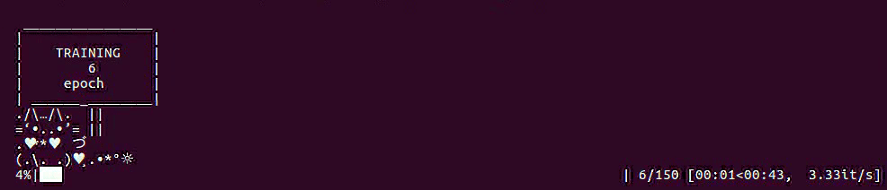

# Inspired by the bunny project, adding more emoji style progress bar

https://twitter.com/tkasasagi/status/1045582451769192449

https://github.com/bheinzerling/bunny

This framework is meant to be modular and flexible.

More emoji will be added. If you want to add any cute emoji, feel free to make a pull request.

# bear


# cat



# bunny


# Usage:

```Python
from bunny import Bunny
import time

# simulate long training epoch
def train_epoch():
	time.sleep(0.3)

# training loop
epochs = range(1, 151)
for epoch in Bunny(epochs,'bear'):  # use bunny like tqdm
    train_epoch()

```

# Installation

Require python > 3.6

pip install git+git://github.com/demoonism/bunny
```
